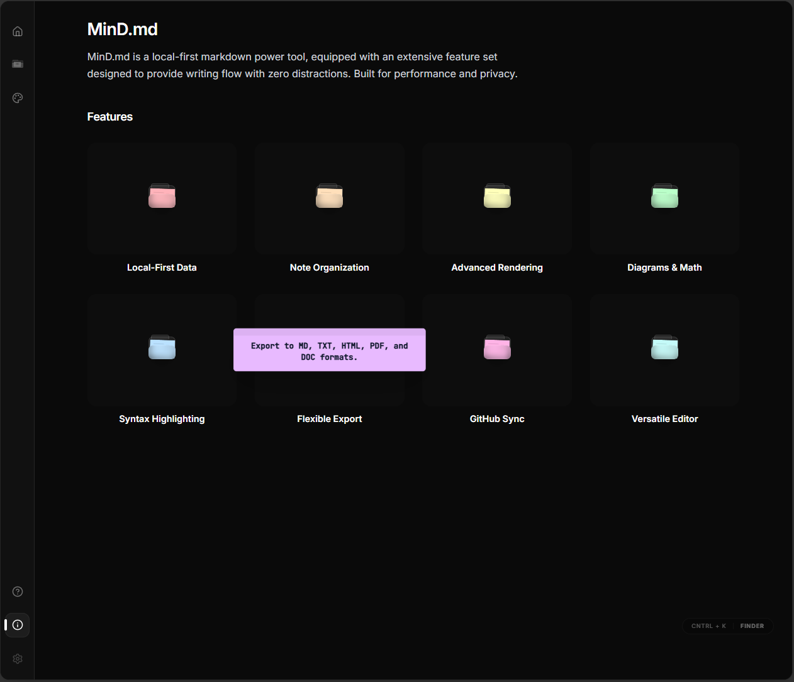
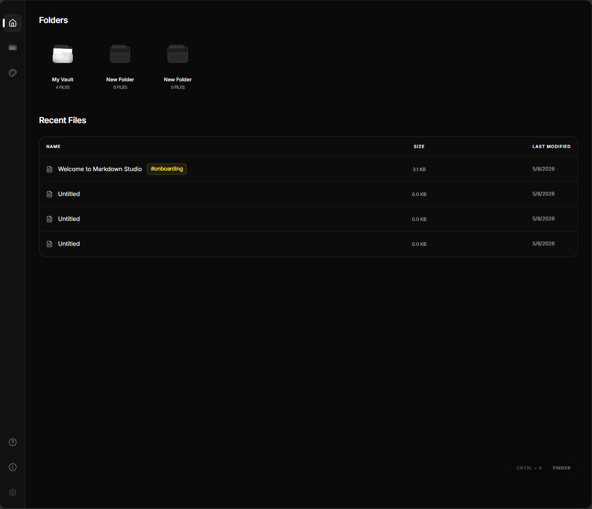
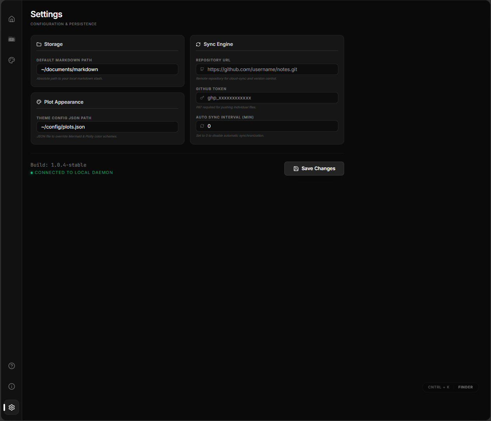
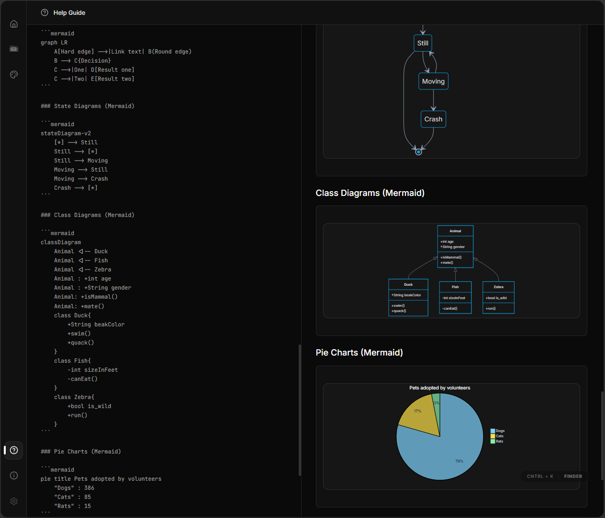

# MinD.md

MinD.md is a local-first markdown power tool, equipped with an extensive feature set designed to provide writing flow with zero distractions. Built for performance and privacy.

## Key Features

### Advanced Markdown Rendering

- **GitHub Flavored Markdown (GFM)**: Fully supports classic Markdown syntax, including tables, task lists, and strikethroughs.
- **Math and LaTeX**: Render block and inline mathematical equations using KaTeX.
- **Diagrams as Code**: Automatically renders Mermaid syntax into diagrams, including flowcharts, sequence diagrams, state diagrams, class diagrams, pie charts, and Gantt charts.
- **Callouts and Directives**: Create visually distinct panels for notes, warnings, tips, information, and cautions.
- **Syntax Highlighting**: Real-time syntax highlighting for code blocks using PrismJS.
- **Table of Contents Generation**: Structure your notes with auto-generated table of contents logic.
- **Raw HTML and Sanitization**: Support for rendering embedded HTML with automatic sanitization to prevent XSS.

### Editor Interface

- **Flexible Workspaces**: Toggle between Edit view, Preview view, and Split view to suit your workflow.
- **Cursor Information**: Live tracking of your current line, column, selected characters, and selected words.
- **Word and Character Counts**: Immediate real-time stats updating as you write.

### Note Organization

- **Nested Folders**: Construct deep directory hierarchies to organize notes exactly how you want.
- **Tagging System**: Add, manage, and filter files utilizing extracted tags.
- **Search System**: Fast fuzzy searching implemented via Fuse.js for finding files or tags quickly.
- **Local Persistence**: Notes and folders are saved automatically to the browser local storage, ensuring work is not lost if the session ends.

### Synchronization and Persistence

- **GitHub Sync**: Connect to a remote GitHub repository using a personal access token (PAT) to push and sync individual note files.
- **Auto Synchronization**: Configurable auto-sync interval that actively updates your remote repository in the background at an interval of your choice.

### Customization

- **Plot Appearance Customization**: Override the default color schemes for plots and diagrams by specifying a local JSON configuration.
- **Theme Independent Interface**: An immersive dark mode aesthetic focusing on minimal distractions.

### Export and Sharing Options

- **Markdown Export**: Download notes in standard `.md` format.
- **Text Export**: Export as raw `.txt`.
- **HTML Export**: Export the fully rendered HTML snippet.
- **PDF Export**: Generate well-formatted PDF files directly from the rendered markdown.
- **DOC Export**: Save notes into formats accessible by word processors.

## Screenshot






## Getting Started

### Installation

Ensure that you have Node.js installed, then clone the repository and run:

1. \`npm install\` to install all required dependencies.
2. \`npm run dev\` to start the development server.

### Available Scripts

- \`npm run dev\`: Boots the Vite development server.
- \`npm run build\`: Builds the project for production.
- \`npm run preview\`: Previews the production build locally.
- \`npm run lint\`: Executes typescript type checking.

### Building Desktop Executables (macOS, Windows, Linux)

You can package MinD.md as a standalone desktop application for macOS, Windows, and Linux using **Electron**.

#### Prerequisites

- Install [Node.js](https://nodejs.org/en)

#### Development Desktop Mode

To run the application in a desktop window during development:

```bash
npm run dev:desktop
```

#### Building the App

To build the executable for your intended operating system, run one of the following commands:

```bash
# For macOS (.app and .dmg)
npm run build:mac

# For Windows (executables)
npm run build:win

# For Linux (.AppImage)
npm run build:linux
```

Once the build completes successfully, you will find your executables in the `release/` directory.

> **Note:** Electron-builder compiles for the operating system it is running on by default. If you encounter issues compiling for a different OS, it's recommended to run the respective build command on that OS, or use GitHub Actions for cross-platform builds.

## Technologies Used

- React 19
- Vite
- Tailwind CSS
- React Markdown
- Mermaid
- KaTeX
- Fuse.js
- PrismJS
- html2pdf.js
